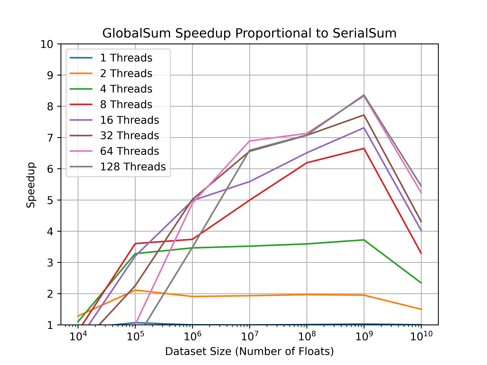
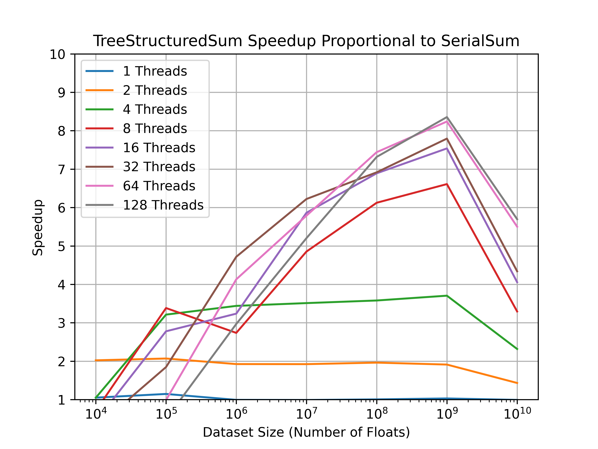

# Result Methodology

These plots were generated using the data collected from the `auto` executable, which ran many tests of 
the different histogram solvers that I made. The plots shown result from running over a cartesian 
product of the following configurations:

- Number of threads: 1, 2, 4, 8, 16, 32, 64, 128 
- Input data size (floating point numbers): 1e4, 1e5, 1e6, 1e7, 1e8, 1e9, 1e10
- Number of bins: 5
- Repeated runs: 10 (per solver per configuration)

In total, this produced 490 runs for each solver, except the serial solver which only had 70 runs as
it was only ever run with 1 thread. In total, this means that there were 1,050 runs done. On my 
2023 14-inch MacBook Pro with a M3 Pro chip and 18 Gb of RAM, this test took 3 hrs and 23 minutes 
to run while plugged in.

# Plots 

These two plots show the speedup of the parallel sums vs. their serial counterpart. From the results we 
can see that for smaller dataset sizes the more threads used the less speed up occurs, likely as the 
time to start up all of the threads is more expensive that the performance benefit provided. 

Up to 1e9 elements and 8 threads, we see evidence of strong scaling across the board as 2 threads 
provides a 2x speedup, 4 threads provides a roughly 3.75x speedup, and 8 threads provides a 6.5x speedup 
at 1e9 elements. This machine has 12 cores, 6 of which are performance cores, and 6 of which are 
efficiency cores, so it makes sense that when jumping to 16 threads we start to see that strong scaling 
no longer holds, as we now are asking for more cores than the machine actually has.

Also, at 1e10 floats we see a sharp decline, likely because the program is becoming memory bound. This 
machine has 18 Gb of RAM, and when requesting 1e10 floats we are requesting ~40 Gb of memory (assuming 
that `sizeof(float) == 4`). This means that we will have to deal with swaps out to disc, which greatly 
reduces our possible memory throughput.

The other plots show the speedup generated by a certain number of threads for a given input range size. 
The upper and lower bounds shown on the plots are the worst case and best speedup generated over the 10 
runs of each solver.

